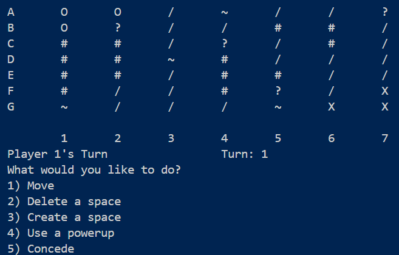

# Dotto

Dotto is a terminal-based board game. The objective of the game is to capture all of your opponents pieces by moving across the board tactically and using powerups wisely.

## Game Context

The board is made up of regular spaces described by the following characters:

* `O` Player 1's pieces
* `X` Player 2's pieces
* `/` Regular space
* `#` Barrier - cannot be moved onto
* `~` Crumbly - may be moved onto, but disappears upon departure
* `?` Powerup - gives the player a random powerup upon arrival
* `@` Portal - teleports a piece to the corresponding portal exit
* ` ` Blank - cannot be moved onto but may be hopped over

Powerups spawn randomly on the map at a given interval (default 5 turns), and will give the player one of the following randomly:

* Double-jump - Allows the player to move two spaces and hop over barriers
* Portal - Allows the player to place a portal pair on the board
* Destroyer - Allows the player to replace a barrier with a regular space

## Gameplay

Each player may perform one of the following each turn:

* Move a piece, but not diagonally
* Convert a regular space to a blank space, and vice versa (maximum of 5 times)
* Use a powerup
* Concede

The game ends when one player either concedes or loses all their pieces.

# Future plans

* Restrict reversal of deletion or creation of spaces for a given turn interval to stop recursive creation deletion
* Add diagonal powerup
* Graphical version